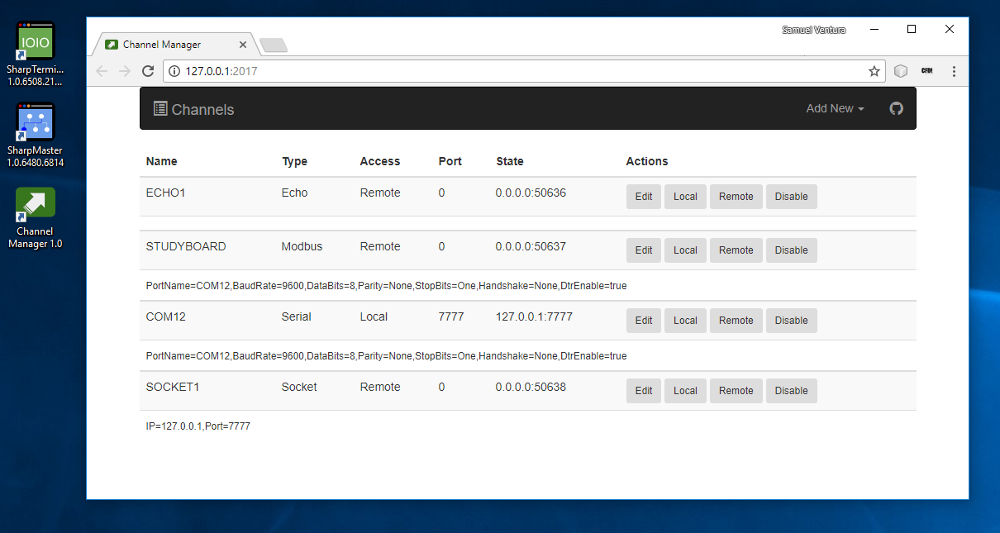
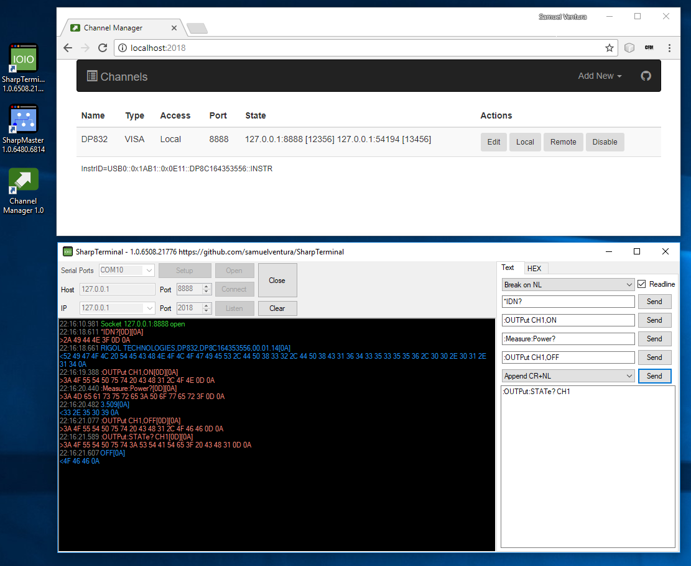

# ChannelManager

## Why?
* [Uncatchable exceptions](https://stackoverflow.com/questions/20708641/objectdisposedexception-safe-handle-has-been-closed) from buggy drivers may kill your app at any time. Isolating hardware access provides a graceful error handling mechanism.
* Developing on a production computer can be a painful experience but may be your only option if your application depends on hardware only accessible thru that computer. Socket exporting hardware allows remote development and testing.

## Features
* Socket export your local Serial Ports
* Socket export your local Modbus RTU devices
* Socket export forwarded TCP ports
* Installs as a Windows Service
* WEB user interface on port 2017
* Save/delete of channels restricted to localhost
* JSON channel directory exposed at http://+:2017/Api/Index
* Channels are process isolated to tackle buggy device drivers
* Plugins are process isolated to avoid DLL cross contamination

## Plugins
* NationalInstruments VISA with NIVISA1700runtime

## Todo
* DLL isolated third party plugins (workdir)
* Auto install required plugins
* Fat exe with embedded views
* Logs should show source
* Websocket for structured comm

